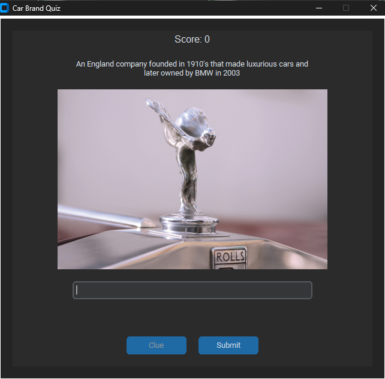

# Car Brand Quiz 🚗



A modern quiz application built with Python that tests your knowledge of car brands and manufacturers. Features a clean, dark-themed interface, image-based clues, and a high score system. Built using CustomTkinter for a modern UI experience.

## ✨ Features

- 🎮 Interactive Quiz Gameplay
  - Score-based gameplay (+10 points per correct answer)
  - Optional image clues (-5 points per clue)
  - High score tracking

- 🎨 Modern UI Features
  - Dark theme interface
  - Responsive layout
  - Custom-styled components
  - Image clues for questions

- 📊 Game Features
  - Player name registration
  - Score tracking
  - High score leaderboard
  - Question management system
  - Comprehensive game instructions

## 🚀 Installation

1. Clone the repository:
```bash
git clone https://github.com/pouryare/car-brand-quiz.git
cd car-brand-quiz
```

2. Create a virtual environment (recommended):
```bash
python -m venv venv
source venv/bin/activate  # On Windows: venv\Scripts\activate
```

3. Install required packages:
```bash
pip install -r requirements.txt
```

## 📦 Requirements

- Python 3.8+
- CustomTkinter >= 5.2.1
- Pillow >= 10.0.0

## 🎮 Usage

Run the application:
```bash
python main.py
```

## 🏗️ Project Structure

```
car-brand-quiz/
├── assets/                 # Static assets
│   ├── data/              # Database storage
│   └── images/            # Image assets
│       ├── clues/         # Question clue images
│       └── logo/          # Application logo
├── pages/                 # UI pages
│   ├── base_page.py       # Base page template
│   ├── game_page.py       # Main game interface
│   ├── home_page.py       # Home screen
│   ├── info_page.py       # Instructions page
│   ├── player_input_page.py  # Player name input
│   ├── score_page.py      # High scores display
│   └── settings_page.py   # Question management
├── utils/                 # Utilities
│   └── image_handler.py   # Image processing
├── config.py             # Configuration settings
├── database_operations.py # Database management
├── game_logic.py         # Core game mechanics
├── main.py              # Application entry point
└── requirements.txt     # Project dependencies
```

## 📋 Module Descriptions

| Module | Description |
|--------|-------------|
| `main.py` | Application entry point and main window management |
| `config.py` | Configuration settings and paths |
| `database_operations.py` | SQLite database operations |
| `game_logic.py` | Core game mechanics and scoring |
| `pages/*.py` | Individual page implementations |
| `utils/image_handler.py` | Image processing utilities |

## 🎯 Game Features

- **Question Management**: Add custom questions with image clues
- **Scoring System**: 
  - +10 points for correct answers
  - -5 points for using clues
- **High Score Tracking**: Persistent leaderboard
- **Player Statistics**: Track player performance
- **Image Clues**: Visual hints for questions

## 🤝 Contributing

Contributions are welcome! Please feel free to submit a Pull Request.

## 📝 License

This project is licensed under the MIT License - see the [LICENSE](LICENSE) file for details.

## 👤 Author

**Pouryare**
* Github: [@pouryare](https://github.com/pouryare)

## 🌟 Show your support

Give a ⭐️ if this project helped you!

---

> Note: This quiz application is designed for educational purposes and to demonstrate Python GUI programming concepts using CustomTkinter.
